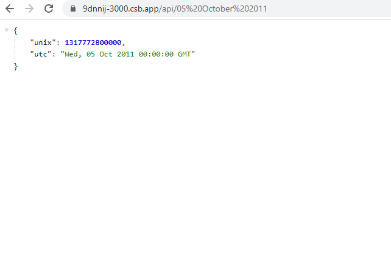

## TIMESTAMP FREECODECAMP

Proyecto propuesto por la pagina: freecodecamp.com para comprobar habilidades en backend y desarrollo de API. API de reloj que al darle una fecha en formato alfabético, numérico o yyy-mm-dd devuelve la equivalencia de tiempo y hora en formato numérico y alfabético.

### Comandos

---

-   **npm run dev**: Ejecuta el proyecto en modo desarrollo, debe ejecutarse el _build_ primero.
-   **npm run dev:listen**: Ejecuta el proyecto en modo desarrollo en escucha, debe ejecutarse el _build_ primero.
-   **npm run build**: Compila el proyecto.
-   **npm run build:listen**: Compila el proyecto en modo escucha.
     

### Pasos para ejecución

---

1. Clonar el repositorio.
2. Ejecutar el comando `npm install` para instalar las librerías, opcionalmente puede instalar las librerías de desarrollo también.
3. Ejecutar el comando `npm run build`
4. Ejecutar el comando `npm run dev`
